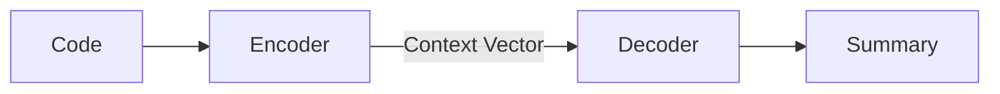

# System Architecture & Logic

This document explains the end-to-end logic of your Code Summarization model, from reading the CSV to training the neural network.

## 1. Data Pipeline

The process starts with your `data/dataset.csv`.

### Step A: Loading & Preprocessing
- **Source**: We read the CSV file which has two columns: `code` (input) and `summary` (target).
- **Filtering**: We remove invalid or extremely short rows.
- **Normalization**: Text is cleaned (whitespace, lowercase) to make it easier for the model.

### Step B: Tokenization
Computers don't understand text, only numbers. We use a **Tokenizer** to split text into "tokens" (words or sub-words) and a **Vocabulary** to map them to unique Integers (IDs).
- **Code**: `def foo():` &rarr; `["def", "foo", "(", ")", ":"]` &rarr; `[4, 12, 5, 6, 7]`
- **Summary**: `Function that foos` &rarr; `["function", "that", "foos"]` &rarr; `[99, 10, 55]`

### Step C: Batching & Padding
We train in small groups called "batches" (e.g., 16 at a time). Since sentences have different lengths, we "pad" them to the same length using a special `<pad>` token so they fit in a matrix.

## 2. Model Architecture (Seq2Seq)

We use a **Sequence-to-Sequence (Seq2Seq)** model, which is standard for translation tasks (Code &rarr; English).

### The Encoder
- **Role**: "Reads" the code.
- **Mechanism**: It uses an **LSTM (Long Short-Term Memory)** network. It processes the code token by token.
- **Output**: After reading the whole function, it produces a **Context Vector** (or hidden state), which is a numerical summary of the code's meaning.

### The Decoder
- **Role**: "Writes" the summary.
- **Mechanism**: Check the Context Vector and generates the summary one word at a time.
- **Attention**: We also use an **Attention Mechanism**. This allows the Decoder to "look back" at specific parts of the source code when generating a specific word (e.g., looking at `return a + b` when generating the word "add").

## 3. Training Loop

How does it learn?

1.  **Forward Pass**: 
    - We feed the model a batch of code.
    - The model guesses the summary.
2.  **Loss Calculation**: 
    - We compare the **Guess** vs. **Actual Summary**.
    - We use **Cross Entropy Loss**. If the model guessed "subtract" but the answer was "add", the loss is high.
3.  **Backward Pass (Backpropagation)**: 
    - We calculate gradients (directions to improve).
    - The **Optimizer (Adam)** updates the model's "weights" to reduce the error next time.

Over many **Epochs** (passes through the dataset), the model gets better at mapping Code &rarr; Summary.
